## Continuous integration of Wi-Fi Examples: Jenkin server configuration guideline (Internal use only)

### Jenkins server configuration
* Step 1: Create a new job build. Under [New Item], enter your job name & select [Pipeline] type project. For example: CI_GSDK_Wi-Fi_examples
* Step 2: Job configuration. Press [Configure] button in the just created project.
    * In "General" tab. Set Git server connection for our project. For example: In our side is GIT3-FSOFT server.
        

        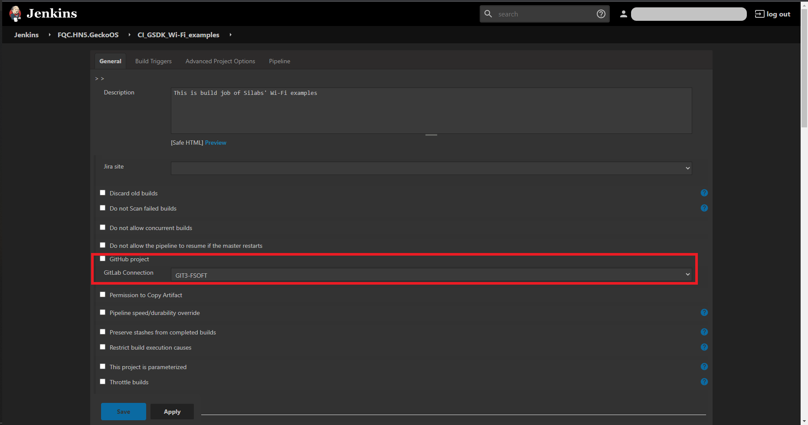
        

    * In "Pipeline" tab. Set URL to our Git repository & branches to build. For example: In our side, we must add our credentials to access internal git system. See [**Credentials Creation**](#adding-credentials) for more details
        

        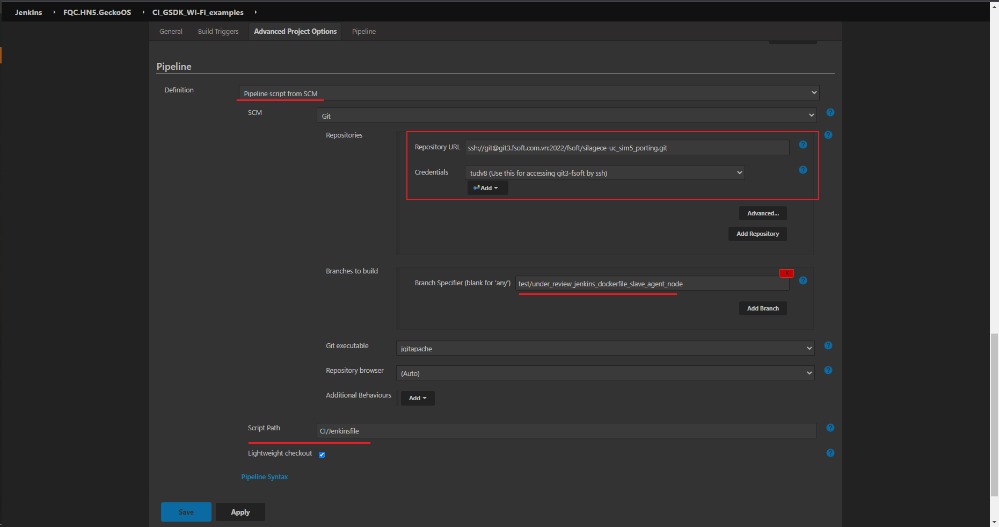
        

    > Note: Script path to directory containing your jenkinsfile
* Step 3: There are many ways to configure build triggers. We consider 2 common ways:
    * Periodically build with schedule:
        

        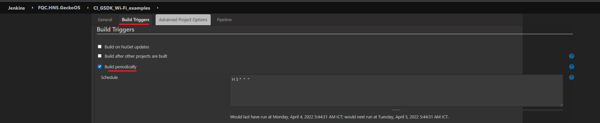
        

    * Push/Merge request events:
        Check on "Build when a change is pushed to..", remember copy the web hook url
        

        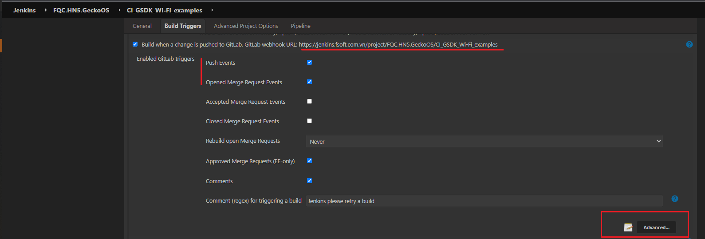
        

        Click on "Advanced", filter branches that can trigger by regex & generate a secret token.
        

        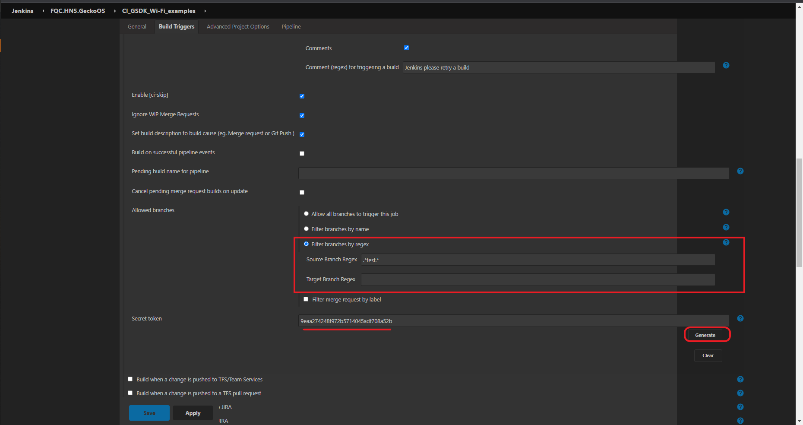
        

        Go to Git server settings (You maybe need to be the master role of your repo), click on Webhook & fill in as the image. Remember to copy & paste the previous secret token from Jenkins server
        

        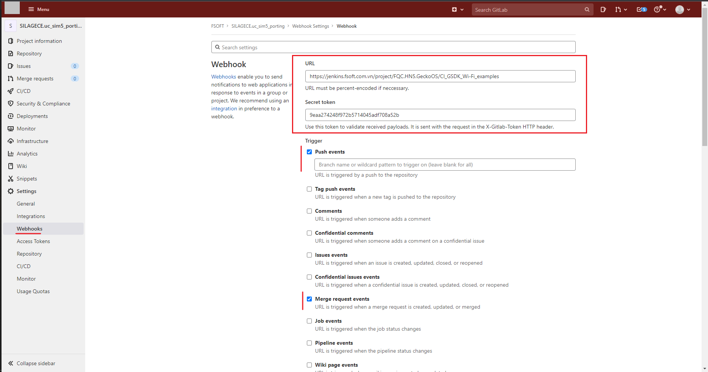
        

        After setting, we can test Webhook by push event
        

        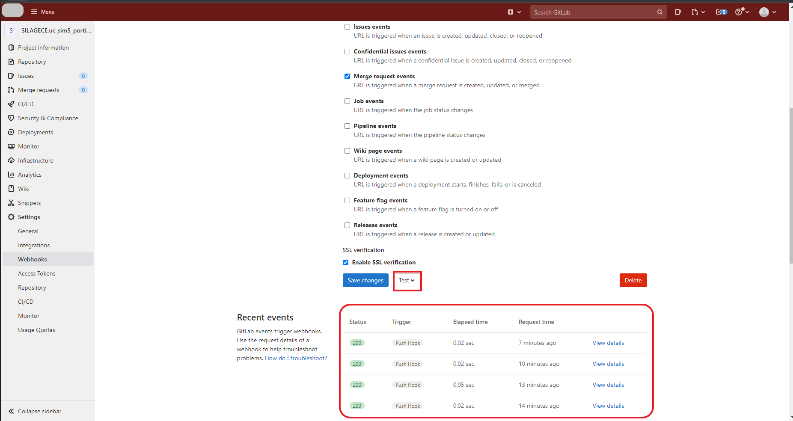
        

> Note: We assume the IT/DevOps department already provide us a slave machine connected to Jenkins server. Remember to change "SLAVE_LABEL" to yours (in our case, slave label is "10.16.118.60"). Actually, we can set "SLAVE_LABEL" in Jenkins server, no need to hard-coded in Jenkinsfile. But I don't think IT department will allow us to set the global environment "SLAVE_LABEL" value on their server. --> We must adapt this by changing the value in Jenkinsfile.
### Adding Credentials 
#### Method #1: Using HTTPS
* Generate Git Access Token
    Under [Settings], click on [Access Tokens]. Fill in & check on boxes as the images:
        

        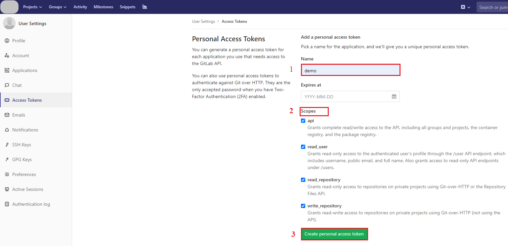
        

    > Important note: Save the generated access token for the next step!
* Adding JK's credentials 
    Back to Jenkins server main page, under [Credentials] tab, click on "(global)" & "Add credentials" with kind: "User name with password". Enter your Git's account & the generated Access Token as your password.
        

        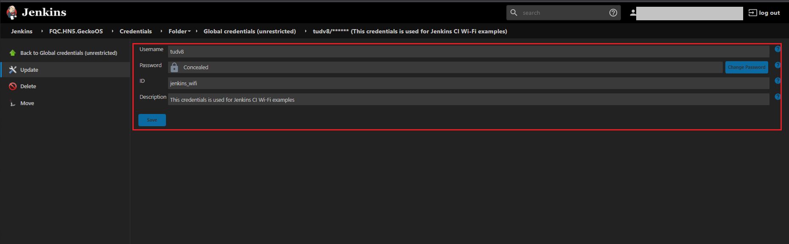
        

#### Method #2: Using SSH
* If already exist, skip this generation step, go to next step. If not, generate private & public SSH keys by using the command tool ssh-keygen on personal machine.
* Skip this step if you already added this. If not, copy public key (file id_rsa.pub) to Git server.
    

    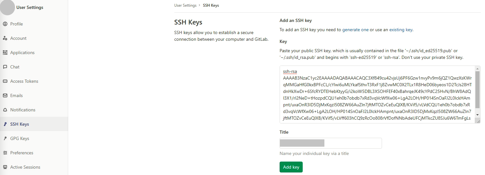
    

* Copy private key (file id_rsa) to Jenkins credentials.
    

    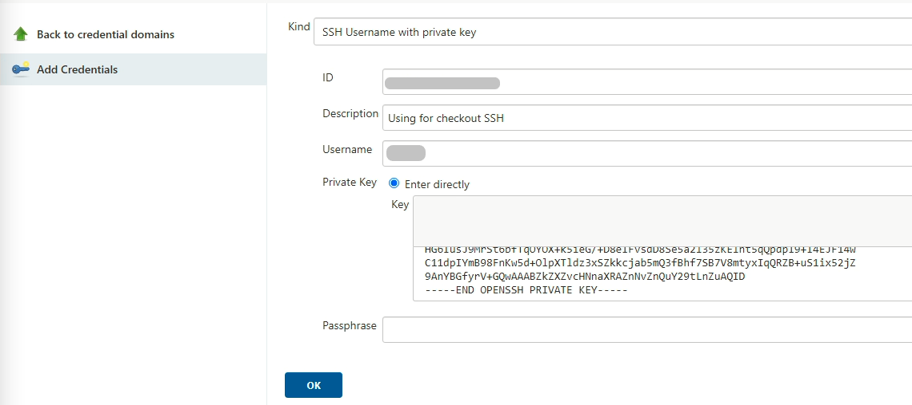
    

